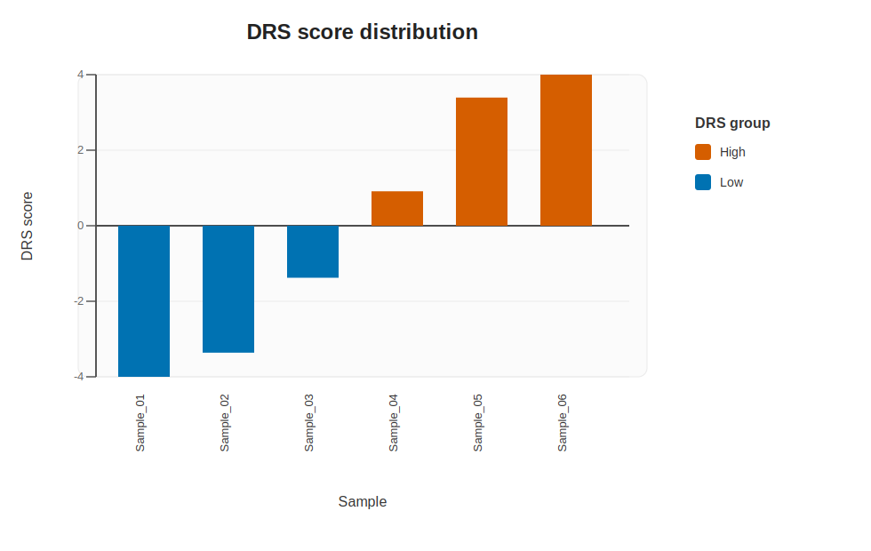

# DisulfRisk
Predicting disulfidptosis-related risk in expression cohorts based on a 20-gene weighted DRS model

### 1.Description
`DisulfRisk` is an R package for calculating a disulfidptosis-related risk score (DRS) from bulk expression matrices. The package is designed for a simple user workflow: read an expression matrix with `data_pre()`, calculate the DRS with `drs_pre()` or `predict_drs()`, and optionally visualize the score distribution with `plot_drs_distribution()`.

### 2.Details
The `DisulfRisk` algorithm uses a fixed 20-gene model and computes the score as:

`DRS = sum(zscore(expression_gene) * coefficient_gene)`

For each model gene, expression is standardized by a gene-wise z-score across the input sample cohort by default. Therefore, the DRS is cohort-relative: if the composition of the input cohort changes, the exact z-scores and final DRS values can also change.

The package is intended for expression matrices with:

| Item | Requirement |
| :--- | :--- |
| Row definition | Genes |
| Column definition | Samples |
| Supported file types | `csv`, `tsv`, `txt` |
| Gene symbols | Stored in the first column by default |
| Duplicate genes | Automatically merged by row-wise mean |
| Minimum sample size | At least 2 samples |
| Required model genes | All 20 genes must be present |

Prediction results include:

| Column | Meaning |
| :--- | :--- |
| `Sample` | Sample name |
| `DRS_score` | Weighted DRS value |
| `DRS_group` | `High` if `DRS_score >= 0`, otherwise `Low` |
| `n_matched_genes` | Number of model genes found in the input |
| `n_missing_genes` | Number of missing model genes |
| `missing_genes` | Missing model genes as a comma-separated string |

The package performs defensive checks and will stop with an informative error if:

- required model genes are missing
- the expression matrix contains non-numeric values
- only one sample is supplied
- any model gene has zero variance across samples

               The 20 gene features used in the DisulfRisk algorithm

| Gene symbol | Full name | Coefficient | DRS direction | Functional note |
| :---: | :--- | :---: | :---: | :--- |
| *RAC1* | Ras Related C3 Botulinum Toxin Substrate 1 | 0.0478 | Positive | Small GTPase involved in lamellipodia formation and actin remodeling |
| *CYFIP1* | Cytoplasmic FMR1 Interacting Protein 1 | 0.0845 | Positive | Connects RAC1 signaling to the WAVE actin-regulatory complex |
| *WASF2* | WASP Family Member 2 | 0.2289 | Positive | Core WAVE complex regulator promoting actin polymerization |
| *BRK1* | BRICK1, SCAR/WAVE Actin Nucleating Complex Subunit | 0.1112 | Positive | Stabilizes the WAVE complex and branched actin assembly |
| *ABI1* | ABI Family Member 1 | -0.6900 | Negative | Scaffold protein in ABL and WAVE signaling, linked to adhesion dynamics |
| *ACTR2* | Actin Related Protein 2 | 0.0608 | Positive | Catalytic component of the Arp2/3 actin branching machinery |
| *ARPC2* | Actin Related Protein 2/3 Complex Subunit 2 | 0.0305 | Positive | Structural Arp2/3 subunit supporting actin nucleation |
| *FLNA* | Filamin A | 0.1594 | Positive | Cross-links actin filaments and coordinates mechanotransduction |
| *FLNB* | Filamin B | -0.2802 | Negative | Organizes cytoskeletal structure and cell architecture |
| *ACTN4* | Actinin Alpha 4 | 0.3771 | Positive | Actin-bundling protein associated with motility and invasive behavior |
| *IQGAP1* | IQ Motif Containing GTPase Activating Protein 1 | 0.1868 | Positive | Cytoskeletal scaffold integrating RAC1, adhesion, and signaling |
| *MYH10* | Myosin Heavy Chain 10 | 0.0235 | Positive | Non-muscle myosin involved in contractility and cell movement |
| *OSTC* | Oligosaccharyltransferase Complex Non-Catalytic Subunit | 0.4044 | Positive | Protein processing component associated with endoplasmic reticulum function |
| *ACSL4* | Acyl-CoA Synthetase Long Chain Family Member 4 | 0.3454 | Positive | Lipid metabolism gene linked to redox-sensitive cell states |
| *DDO* | D-Aspartate Oxidase | 0.2740 | Positive | Oxidative metabolism enzyme involved in amino acid catabolism |
| *PDLIM1* | PDZ And LIM Domain 1 | 0.0206 | Positive | Cytoskeletal adaptor related to stress fiber organization |
| *DSTN* | Destrin | -0.2326 | Negative | Actin depolymerization factor controlling filament turnover |
| *VCL* | Vinculin | -0.2538 | Negative | Focal adhesion and mechanosensing protein at the actin-membrane interface |
| *CD44* | CD44 Molecule | 0.0306 | Positive | Cell adhesion and extracellular matrix interaction receptor |
| *YTHDC1* | YTH Domain Containing 1 | -0.3761 | Negative | Nuclear m6A reader involved in RNA processing and splicing regulation |

Interpretation of the coefficient direction:

- Positive coefficient: higher expression z-score increases the DRS
- Negative coefficient: higher expression z-score decreases the DRS

### 3.Installation
The recommended way to install `DisulfRisk` from GitHub is with `devtools`.

```r
# Step 1. Install devtools if it is not already available
if (!requireNamespace("devtools", quietly = TRUE))
    install.packages("devtools")

# Step 2. Load devtools
library(devtools)

# Step 3. Install DisulfRisk directly from GitHub
devtools::install_github("WenhuiShi97/DisulfRisk", dependencies = TRUE, upgrade = "never")

# Step 4. Load the package
library(DisulfRisk)
```

Typical installation messages may look like:

```r
#> Downloading GitHub repo WenhuiShi97/DisulfRisk@HEAD
#> * building 'DisulfRisk_0.1.0.tar.gz'
#> * installing *source* package 'DisulfRisk' ...
#> ** using staged installation
#> ** R
#> ** inst
#> ** byte-compile and prepare package for lazy loading
#> ** help
#> ** building package indices
#> ** testing if installed package can be loaded from temporary location
#> ** testing if installed package can be loaded from final location
#> * DONE (DisulfRisk)
```

If you want to confirm that the package example files were installed correctly:

```r
system.file("extdata", package = "DisulfRisk")
```

### 4.Example input
The package ships with a built-in example file:

```r
path <- system.file("extdata", "example_expression.csv", package = "DisulfRisk", mustWork = TRUE)
path
```

`example_expression.csv` contains all 20 model genes, several non-model genes, and 6 samples. A preview of the file is shown below.

| Gene | Sample_01 | Sample_02 | Sample_03 | Sample_04 | Sample_05 | Sample_06 |
| :--- | ---: | ---: | ---: | ---: | ---: | ---: |
| RAC1 | 5.1 | 5.8 | 6.2 | 6.9 | 7.5 | 8.0 |
| CYFIP1 | 8.4 | 7.9 | 7.1 | 8.7 | 9.2 | 9.8 |
| WASF2 | 4.2 | 4.9 | 5.4 | 6.0 | 6.7 | 7.1 |
| BRK1 | 7.3 | 7.0 | 7.8 | 8.1 | 8.6 | 9.0 |
| ABI1 | 10.2 | 9.5 | 9.0 | 8.6 | 8.1 | 7.4 |
| ACTR2 | 6.1 | 6.4 | 6.9 | 7.2 | 7.8 | 8.3 |
| GAPDH | 12.0 | 12.2 | 12.4 | 12.7 | 12.9 | 13.1 |
| ACTB | 11.4 | 11.3 | 11.5 | 11.8 | 12.0 | 12.2 |

### 5.Examples
```r
# Data preprocessing -------------------------------------------------------
library(DisulfRisk)

path <- system.file("extdata", "example_expression.csv", package = "DisulfRisk", mustWork = TRUE)
input_data <- data_pre(path)

# Prediction ---------------------------------------------------------------
result <- drs_pre(input_data)
head(result)
```

Example prediction output:

| Sample | DRS_score | DRS_group | n_matched_genes | n_missing_genes | missing_genes |
| :--- | ---: | :---: | ---: | ---: | :--- |
| Sample_01 | -5.2573 | Low | 20 | 0 |  |
| Sample_02 | -3.3609 | Low | 20 | 0 |  |
| Sample_03 | -1.3770 | Low | 20 | 0 |  |
| Sample_04 | 0.9118 | High | 20 | 0 |  |
| Sample_05 | 3.3935 | High | 20 | 0 |  |
| Sample_06 | 5.6898 | High | 20 | 0 |  |

If you want to call the lower-level functions explicitly:

```r
model <- load_drs_model()
result <- predict_drs(input_data, model = model)
```

To visualize the score distribution:

```r
# Fix the y-axis to -4 to 4 for a compact display on the README page
plot_drs_distribution(result, ylim = c(-4, 4))
```

Example DRS distribution plot:



### 6.Notes for users

1. `data_pre()` accepts `csv`, `tsv`, and `txt` expression matrices.
2. By default, the first column is treated as the gene symbol column.
3. Duplicate gene symbols are merged automatically by mean expression.
4. Missing model genes are not ignored silently; the function stops and reports them.
5. Because z-scores are calculated within the supplied cohort, DRS values from different cohorts should be compared with caution unless the same preprocessing strategy is used.

### 7.Bundled files

| File | Purpose |
| :--- | :--- |
| `inst/extdata/drs_coefficients.csv` | Bundled 20-gene coefficient table used by `load_drs_model()` |
| `inst/extdata/example_expression.csv` | Example expression matrix used in the README, examples, and tests |
| `inst/extdata/2_Model_Coefficients.csv` | Existing project file retained in the repository |

### 8.Citation

If you use `DisulfRisk` in your work, please cite:

Shi W. *Disulfidptosis phenotype defines prognostically adverse glioma states associated with immune exhaustion*. Unpublished manuscript.
